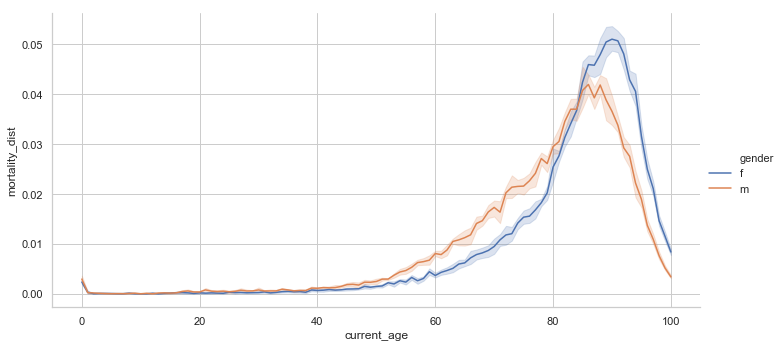
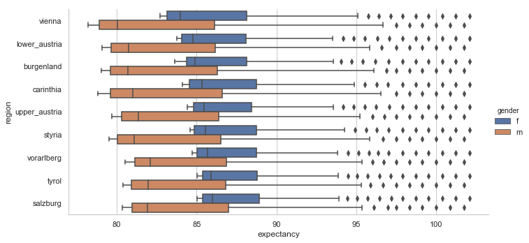
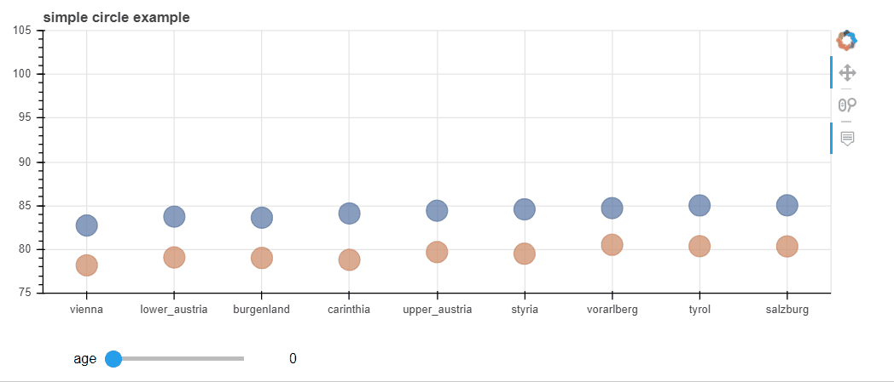

# Life Expectancy Austria  2019

Interactive visualization of life expectancy in Austria.  

For interactive visualization, the notebook must be executed locally.

## Mortality Distribution by Gender

Up to the age of 40, the mortality rates of both women and men are relatively similar. From 40 to about 85, a gap opens between men and women. At this age, men have a much higher probability of dying. The distribution of women is overall narrower. In other words, mortality takes place in a shorter period than among men.

## Boxplot by Gender and Region

The quartiles and the median show that women generally have a higher life expectancy in Austria. Further, the interquartile range (IQR) for women is narrower. Also, the interquartile range (IQR) for women is more restricted.

## Interactive Visualization

Blue circles represent women and orange circles men. It may seem contradictory that life expectancy is higher for older people than for young people. However, someone who is 25 years old must be the same age as someone who is 80 before they can get any older.

Data Sources: [Statistik Austria](http://www.statistik-austria.at/web_de/statistiken/menschen_und_gesellschaft/bevoelkerung/sterbetafeln/index.html)  

Inspired by:

- [gapminder.org](https://www.gapminder.org/tools/)
- [Ben Fry Visualizing Data Process](https://www.dashingd3js.com/the-data-visualization-process)
